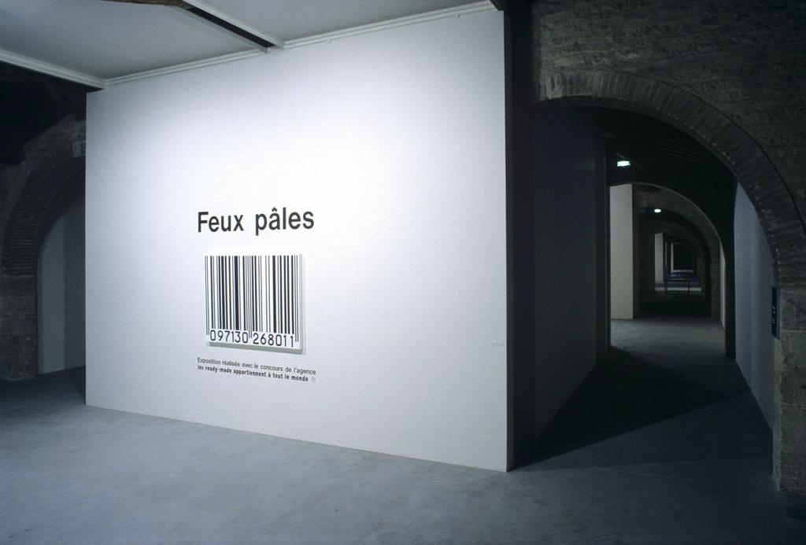
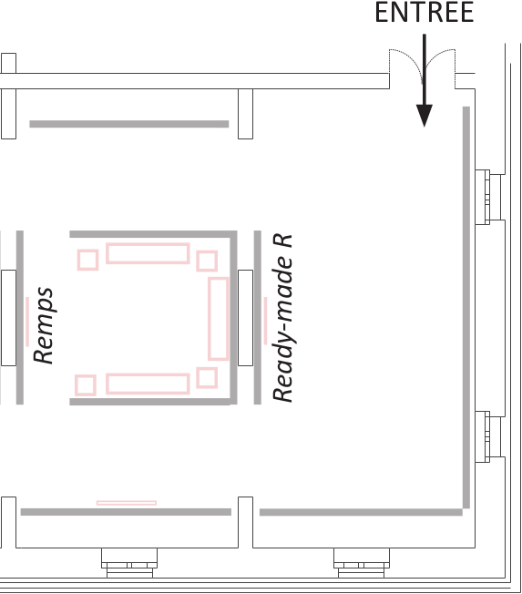

# Documenter les accrochages d’exposition ou de collection muséales&#0160;: une approche ontologique

<!-- Documenting exhibition or museum collections hangings: an ontological approach -->

**Emmanuel Château-Dutier, David&#0160;Valentine, Zoë&#0160;Renaudie et Lena&#0160;Krause**

19 janvier 2024

  

    
  

  

    
  

  

    
  

/** Notes **/

- Hi!

<!-- Cette démonstration vise à présenter une ontologie informatique développée au sein du laboratoire Ouvroir d’histoire de l’art et de muséologie numérique de l’Université de Montréal. Cette ontologie se destine à décrire de manière explicite et formelle les traits d’un accrochage ou d’une exposition (proximité et contiguïté des œuvres, vis-à-vis, etc.). Dans un contexte documentaire souvent lacunaire, ce modèle abstrait permet l’enregistrement de l’information historique concernant les accrochages grâce à une approche spatiale définissant les possibilités d’inférences topologiques entre les objets de l’espace expographique. La démonstration s’appuie sur un jeu de données décrivant l’exposition Feux pâles de Philippe Thomas (CAPC de Bordeaux, 1990) et sur l’utilisation d’un outil graphique pour la formulation de requêtes et l’exploration des données. -->

===vvvvvv===

## Table

1. Le projet Display
1. Approche ontologique de la topologie de l’exposition
1. Étude de cas&#0160;: *Feux pâles*
1. Entrepôt RDF et interface Web

===>>>>>>===

## The *Display* Project

- **Reconstitution** d’accrochages d’exposition ou de collection muséales
- **Basée** sur de la documentation historique hétérogène et lacunaire

/** Notes **/

- D'abord, l'utilisation des outils que je vous présente s'inscrit dans le cadre du projet Display, réalisé au laboratoire L'Ouvroir d'histroire de l'art et de muséologie numériques.
- C'est un projet qui vise la reconstitution d'exposition et d'accrochages historiques, dans divers types d'environnements numériques
- Et ce, à partir d'une documentation historique de nature hétérogène (vues d’exposition, des listes de prêts, plans des salles d’exposition, des catalogues, etc.), donc une documentation qui comporte toute sorte de lacunes et d'incertitudes en lien avec les informations que l'on peut utiliser pour procéder à ces reconstitutions.

===vvvvvv===

## Spatial View on the Exhibition

foo bar

===vvvvvv===

## 3D for Historical Reconstruction

foo bar

===vvvvvv===

## Modèle de documentation des accrochages

- Modèle de documentation :
    - pérennisation et interopérabilité des données sur les expositions
    - prise en charge des incertitudes liées aux sources historiques
- Ontologie informatique pour décrire les expositions ou les accrochages dans une perspective **topologique**

/** Notes **/

- Pour palier ce problème, la première phase du projet consiste à élaborer un modèle de documentation, qui se veut pérenne et interopérable
- et qui vise à prendre en charge les incertitudes liées aux sources historiques
- La solution qu'on explorons actuellement est celle d'une ontologie informatique qui vient soutenir la recherche et la collecte de l’information historique
- et qui vient permettre la description formelle des expositions dans une perspective particulière, qui est celle des relations topologiques des objets dans l'espace de l'exposition.
- que l'on peut visualiser ainsi.

**varia**

la formulation des hypothèses et la génération de reconstitutions, éventuellemetn de faire usage des données dans les reconstitutions, mais aussi dans n'imoprte quel projet

- idée de la disposition spatiale des objets, dans une exposition, à l’aide d’un modèle documentaire qui permet la description des relations topologiques abstraites entre les objets
- Pourquoi abstraite? Documentation lacunaire, qui est loin de tout nous révèler sur les expositions,

===vvvvvv===

## The Display Application

===>>>>>>===

# The Display Ontology

===vvvvvv===

## Ontological Core

A perspective on the (art) exhibition based on:

- concept of *Exhibit*
- spatial logics (definition of abstract topological relationships)

===vvvvvv===

## The Main Conceptualization

- everything takes place in exhibition spaces
- every exhibition entity (artistic or technical) is an Exhibit

/** Notes **/

- And that is the conceptualization we want to share with the museology community using the semantic web tools.

===vvvvvv===

## The Exhibit Class

diagramme

===vvvvvv===

## Handling Space

Reusing BOT

===vvvvvv===

## The `bot:` & `display:` Alignment Strategy

===vvvvvv===

## Handling Tolopogical Relationships

test

===vvvvvv===

<!-- .slide: data-background-iframe="https://ouvroir.github.io/display-ontology/" data-background-interactive class="stack" -->

/** Notes **/

- Ce que vous voyez ici, c’est une représentation visuelle de l'ontologie, donc du modèle
- Qui définit les entités et le vocabulaire que l'on peut utiliser poutr procéder à nos descriptions
- En bleu foncé, c'est notre point de départ, BOT, une petite ontologie qui sert à décrire les relations topologiques abstraites des espaces d'un bâtiment
- En bleu pâle, c'est la spécialisation de ce modèle que nous avons préparé, dans le cadre du projet, pour décrire plus spécifiquement les accrochages dans une exposition
- Et ça passe par deux entités, espace et l'expôt, et les relations topologiques entre ces expôts peuvent être décrites par ce vocabualire.
- Et ça nous donne un contexte qui se prête bien la description topologique, en permettant de décrire, par exemple, la symétrie ou la transitivité des propriétés, et d'utiliser des inférences qui viennent enrichir les données historiques

**varia**

- Par exemple, l'adjacence des espaces dans un bâtiment
- Ce qu'on fait essentiellement, c'est une spécialisation de la Building Topology Ontology pour la description de la topologie des objets dans un espace expographique
- Un travail particulier a été mené sur les relations topologiques destiné à pouvoir tirer au maximum parti des inférences.

===>>>>>>===

<!-- .slide:
data-background-image="./img/usecase-00-front.jpeg" data-background-size=""
-->

Photo. : Frédéric Delpech ©&#0160;Claire&#0160;Burrus, Paris / Jan Mot, Bruxelles.

/** Notes **/

# Use Case: *Feux pâles*

===vvvvvv===

<!-- What we might need here is the r-stack class with fragments: https://revealjs.com/layout/#stack (but it doesn't work with the need of updating textual content)-->

## Exhibits & Spaces Relationship

`rdf:type`: Instantiation syntax

/** Notes **/

- We simply populate the `display:Exhibit` class to indicate the presence of an exhibit in the exhibition.

===vvvvvv===

## Exhibits & Spaces Relationship

Combining the instantiation and the instance

/** Notes **/

- So from now we can combine the instantiation within a single entity, just to make things lighter.

===vvvvvv===

## Exhibits & Spaces Relationship

`display:containsExhibit`: A space contains an exhibit 

<!-- 

  
  

 -->

/** Notes **/

- And we put that work in an exhibition space.

===vvvvvv===

## Exhibits & Spaces Relationship

`display:HangingInterface`: Hanging the exhibits

/** Notes **/

- Using the Hanging Interface Class it can easily be stated that the CAPC work (the barcode that welcomes visitors, that we have just seen before) is hung on the entrance display wall, and is contained in the exhibition space.

===vvvvvv===

## Exhibits & Spaces Relationship

The `bot:` namespace: Describing spaces

/** Notes **/

- The description of spaces uses the classes and properties of the `bot:` namespace.

===vvvvvv===

## Exhibits & Spaces Relationship

`display:hasExhibitionSpace`: Space contains space

/** Notes **/

- foo

===vvvvvv===

## *Feux pâles*: Préambule

<figure>
  
  <figcaption>Vue de l’exposition Feux pâles (1990), “Préambule”. Photo. : Frédéric Delpech  ©&#0160;Claire&#0160;Burrus, Paris / Jan Mot, Bruxelles.</figcaption>
</figure>

/** Notes **/

- And finally the entrance area communicates with a first room via two passages.

===vvvvvv===

## Exhibits & Spaces Relationship

`display:PathwayInterface`: Circulating between spaces

===vvvvvv===

## Exhibition Space Configuration

<figure>
  
  <figcaption>Détail su plan de l’exposition Feux pâles au CAPC, galerie Foy. ©&#0160;Zoë&#0160;Renaudie.</figcaption>
</figure>

/** Notes **/

- notes

===vvvvvv===

## Exhibition Space Configuration

Graphe avec mise en évidence sur le plan.

/** Notes **/

- notes

===vvvvvv===

## Reasoning

Reasonning for spatial reconstitution

And what about querying? Definitely the best way to reason with a model!

===vvvvvv===

<!-- .slide: data-background-iframe="http://127.0.0.1/~david/dev-web/display-vitrine/feux-pales/" data-background-interactive class="stack" -->

/** Notes **/

- chercher dans cet espace
- les expôts qui sont vis-à-vis les uns les autres
- et qui entretiennent une relation topologique quelconque
- avec des éléments structurants de l'espace
- alors j'esssaie de construire un espace, abstrait, en exploitant les relation topologiques entre les objets qui sont exposés
- et par inférence, parce que les expôts sont en relation avec les éléments structurant et parce que la propriété faces est symétrique, à ce que ces deux élgalements structrurant soitent également vis-à-vis
- et je découvre effectivement qu'ily a deux...
- alors voilà, ce sont les outils que nous pourrons utiliser bientôt dans ce projet pour soutenir la formulation d’hypothèses l’enregistrement des interprétations.

===>>>>>>===

# Conclusion

foo

===vvvvvv===

## Références

  
Guillem, A., Gros, A., Reby, K., Abergel, V. et DeLuca, L. (2023). RCC8 for CIDOC CRM: Semantic Modeling of Mereological and Topological Spatial Relations in Notre-Dame de Paris. Dans A. Bikakis, R. Ferrario, S. Jean, B. Markhoff, A. Mosca et M. Nicolosi Asmundo (dir.), <em>SWODCH’23&#0160: International Workshop on Semantic Web and Ontology Design for Cultural Heritage</em>. <a href="https://hal.science/hal-04275714">https://hal.science/hal-04275714</a>

  
  
Rasmussen, M. H., Lefrançois, M., Schneider, G. F. et Pauwels, P. (2021a). BOT: The building topology ontology of the W3C linked building data group. <em>Semantic Web</em>, <em>12</em>(1), 143‑161. <a href="https://doi.org/10.3233/SW-200385">https://doi.org/10.3233/SW-200385</a>

  
  
Rasmussen, M. H., Pauwels, P., Lefrançois, M. et Schneider, G. F. (2021b, 28 juin). Building Topology Ontology [Draft Community Group Report]. <a href="https://w3c-lbd-cg.github.io/bot/">https://w3c-lbd-cg.github.io/bot/</a>

  
  
Renaudie, Z. (2019). <em>Le monde de <em>Feux pâles</em>, l’exposition à l’épreuve de la conservation-restauration, tome I</em> [Mémoire Master II, École supérieure d’art d’Avignon]. <a href="https://www.academia.edu/40627194/Renaudie_Zo%C3%AB_Le_monde_de_Feux_p%C3%A2les_lexposition_%C3%A0_l%C3%A9preuve_de_la_conservation_restauration_TOME_I">https://www.academia.edu/40627194/Renaudie_Zoë_Le_monde_de_Feux_pâles lexposition_à_l’épreuve_de_la_conservation_restauration_TOME_I</a>

  

À la manière des espaces, les expôts peuvent être contenus par d'autres éléments de l'exposition. Il est ainsi possible de décrire l'ensemble des oeuvres contenues par les vitrines de la salle Inventaire du mémorable. Les bustes situés de part et d'autre de cette vitrine se trouvent à sa droite et à sa gauche, ce qui permettra de conclure qu'elle se trouve entre ces deux expôts.