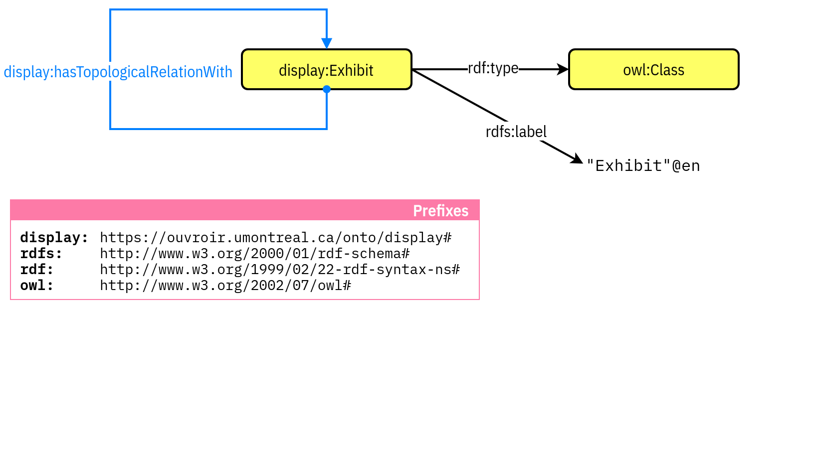

# Documenting exhibition and collection displays: an ontological approach

<!-- Documenting exhibition or museum collections hangings: an ontological approach -->

**Emmanuel Château-Dutier, David&#0160;Valentine, Zoë&#0160;Renaudie et Lena&#0160;Krause**

DH2024, 19 janvier 2024

  

    
  

  

    
  

  

    
  

===vvvvvv===

===vvvvvv===

## Context of the project

### New uses of collections in art museums

- SSHRC Partnership
- ~20 researchers, 6 canadian museums
- First axis : @todo (Marie Fraser)
- [www.cieco.co](https://www.cieco.co)

### Ouvoir d’histoire de l’art et de muséologie numériques

- Digital lab to support the research
- [ouvroir.umontreal.ca](https://ouvroir.umontreal.ca)

===vvvvvv===

## Cultural heritage documentation models

- [CIDOC-CRM](http://www.cidoc-crm.org)
- [CRMgeo](doi:[10.1007/s00799-016-0192-4](https://doi.org/10.1007/s00799-016-0192-4).): A Spatiotemporal Extension of CIDOC-CRM
- Art Tracks http://www.museumprovenance.org
- [OntoExhibit](https://complexhibit-project.github.io/OntoExhibit/index-en.html) (other presentation in this conference)
- [CRMaaa ontology](https://ontome.net/namespace/246)

===vvvvvv===

## Table of content

1. A spatial perspective on the exhibition
1. The Display Ontology
1. Pattern presentation with use case: *Feux pâles*

===>>>>>>===

# A spatial perspective on the exhibition

<!-- @todo check take -->

===vvvvvv===

## 3D for Historical Reconstruction

<iframe width="900" height="506.25" src="https://www.youtube.com/embed/XCqiSbplATU?si=tMcEuk9Lycfnties&amp;start=47" title="YouTube video player" frameborder="0" allow="accelerometer; autoplay; clipboard-write; encrypted-media; gyroscope; picture-in-picture; web-share" referrerpolicy="strict-origin-when-cross-origin" allowfullscreen></iframe>

Das Städel museum in 3D, Ihr Virtueller Besuch im Jahr 1878 http://zeitreise.staedelmuseum.de/vr-app/

===vvvvvv===

## From 3D to a documentation model

In our use case

- archival and visual sources are essentials
- limited constructive clues (vs archeology)

-> a spatial documentation model independant of any visualisation techniques

- data exchange and long term preservation
- various applications
- 3D visualisations

===vvvvvv===

## The Display Application

- Graphical user interface for art historian
- hypothesis and analysis
- 3D and simplified visualisation rendering

===>>>>>>===

# The Display Ontology

===vvvvvv===

## Ontological Core

A perspective on the exhibition based on:

- concept of *Exhibit*
- spatial logics (definition of abstract topological relationships)

===vvvvvv===

## The Main Conceptualization

- everything takes place in exhibition spaces
- every exhibition entity (artistic or technical) is an *Exhibit*

/** Notes **/

- And that is the conceptualization we want to share with the museology community using the semantic web tools.

===vvvvvv===

## The Exhibit Class

`display:Exhibit`

===vvvvvv===

## Handling Description of Space

Reusing the Building Topology Ontology

> The Building Topology Ontology (BOT) is a minimal OWL DL ontology for defining relationships between the sub-components of a building.

Specification: https://w3c-lbd-cg.github.io/bot/
Namespace: `https://w3id.org/bot#`

===vvvvvv===

## Handling Description of Space

The Building Topology Ontology (BOT)

<figure class="w75">
  
  <figcaption>Classes and relationships involved in Zones (Rasmussen et al., 2021)</figcaption>
</figure>

===vvvvvv===

## The `bot:` & `display:` Alignment Strategy

===vvvvvv===

## Handling Tolopogical Relationships

===vvvvvv===

## Handling Tolopogical Relationships

===vvvvvv===

## Linkage with CIDOC and heritage ontologies

===vvvvvv===

## Linkage with CIDOC and heritage ontologies

===>>>>>>===

<!-- .slide:
data-background-image="./img/use-case-00-front.jpeg" data-background-size="auto 100%"
-->

Photo. : Frédéric Delpech ©&#0160;Claire&#0160;Burrus, Paris / Jan Mot, Bruxelles.

/** Notes **/

# Use Case: *Feux pâles*

===vvvvvv===

<!-- What we might need here is the r-stack class with fragments: https://revealjs.com/layout/#stack (but it doesn't work with the need of updating textual content)-->

## Exhibits & Spaces Relationship

`rdf:type`: Instantiation syntax

/** Notes **/

- We simply populate the `display:Exhibit` class to indicate the presence of an exhibit in the exhibition.

===vvvvvv===

<!-- .slide: data-visibility="hidden" -->

## Exhibits & Spaces Relationship

Combining the instantiation and the instance

/** Notes **/

- So from now we can combine the instantiation within a single entity, just to make things lighter.

===vvvvvv===

## Exhibits & Spaces Relationship

`display:containsExhibit`: A space contains an exhibit 

<!-- 

  
  

 -->

/** Notes **/

- And we put that work in an exhibition space.

===vvvvvv===

## Exhibits & Spaces Relationship

`display:HangingInterface`: Hanging the exhibits

/** Notes **/

- Using the Hanging Interface Class it can easily be stated that the CAPC work (the barcode that welcomes visitors, that we have just seen before) is hung on the entrance display wall, and is contained in the exhibition space.

===vvvvvv===

## Exhibits & Spaces Relationship

The `bot:` namespace: Describing spaces

/** Notes **/

- The description of spaces uses the classes and properties of the `bot:` namespace.

===vvvvvv===

## Exhibits & Spaces Relationship

`display:hasExhibitionSpace`: Space contains space

/** Notes **/

- foo

===vvvvvv===

## *Feux pâles*: Préambule

<figure class="w75">
  
  <figcaption>Vue de l’exposition Feux pâles (1990), “Préambule”. Photo. : Frédéric Delpech  ©&#0160;Claire&#0160;Burrus, Paris / Jan Mot, Bruxelles.</figcaption>
</figure>

/** Notes **/

- And finally the entrance area communicates with a first room via two passages.

===vvvvvv===

## Exhibits & Spaces Relationship

`display:PathwayInterface`: Circulating between spaces

===vvvvvv===

## Exhibition Space Configuration

  

    <figure>
      
      <figcaption>
        Détail du plan de l’exposition Feux pâles au CAPC, galerie Foy. ©&#0160;Zoë&#0160;Renaudie.
      </figcaption>
    </figure>
  

  

    
  

===vvvvvv===

## Exhibition Space Configuration

  

    <figure>
      
      <figcaption>
        Détail du plan de l’exposition Feux pâles au CAPC, galerie Foy. ©&#0160;Zoë&#0160;Renaudie.
      </figcaption>
    </figure>
  

  

    
  

===vvvvvv===

## Exhibition Space Configuration

  

    <figure>
      
      <figcaption>
        Détail du plan de l’exposition Feux pâles au CAPC, galerie Foy. ©&#0160;Zoë&#0160;Renaudie.
      </figcaption>
    </figure>
  

  

    
  

/** Notes **/

- So where are now going to the next space!

===vvvvvv===

## *Feux pâles*: De la propriété littéraire et artistique

<figure class="w75">
  
  <figcaption>
    Vue de l’exposition Feux pâles (1990), salle 10 “De la propriété littéraire et artistique”. Photo.&#0160;: Frédéric Delpech ©&#0160;Claire&#0160;Burrus, Paris / Jan Mot, Bruxelles.
  </figcaption>
</figure>

===vvvvvv===

## Intersecting Exhibits

  

    <figure>
      
      <figcaption>
        Détail du plan de l’exposition Feux pâles au CAPC, galerie Foy. ©&#0160;Zoë&#0160;Renaudie.
      </figcaption>
    </figure>
  

  

    
  

===vvvvvv===

## *Feux pâles*: Le cabinet d’amateur

<figure class="w75">
  
  <figcaption>
    Vue de l’exposition Feux pâles (1990), salle 2 “Le Cabinet d’amateur”. Photo. : Frédéric Delpech ©&#0160;Claire&#0160;Burrus, Paris / Jan Mot, Bruxelles.
  </figcaption>
</figure>

===vvvvvv===

## Topological Relationship Between Exhibits

`display:faces`: vis-à-vis exhibits

  

    <figure>
      
      <figcaption>
        Vue de l’exposition Feux pâles (1990), salle 2 “Le Cabinet d’amateur”. Photo. : Frédéric Delpech ©&#0160;Claire&#0160;Burrus, Paris / Jan Mot, Bruxelles.
      </figcaption>
    </figure>
  

  

    
  

===vvvvvv===

## Topological Relationship Between Exhibits

<figure class="w75">
  
  <figcaption>
    Vue de l’exposition Feux pâles (1990), salle 1 “Inventaire du mémorable”. Photo.&#0160;: Frédéric Delpech © ©&#0160;Claire&#0160;Burrus, Paris / Jan Mot, Bruxelles.
  </figcaption>
</figure>

===vvvvvv===

## Topological Relationship Between Exhibits

`display:Display`: aggregate of exhibits

===vvvvvv===

## Reasoning: Enhance the graph with the `OWL` semantics

===>>>>>>===

# Conclusion

foo

===vvvvvv===

<!-- .slide: data-background-iframe="https://ouvroir.github.io/display-ontology/" data-background-interactive class="stack" -->

===vvvvvv===

## Merci !

- Display ontology [https://ouvroir.github.io/display-ontology/](https://ouvroir.github.io/display-ontology/)
- [ouvroir.umontreal.ca](https://ouvroir.umontreal.ca)

  

    
  

  

    
  

  

    
  

  

===vvvvvv===

## Références

  
Guillem, A., Gros, A., Reby, K., Abergel, V. et DeLuca, L. (2023). RCC8 for CIDOC CRM: Semantic Modeling of Mereological and Topological Spatial Relations in Notre-Dame de Paris. Dans A. Bikakis, R. Ferrario, S. Jean, B. Markhoff, A. Mosca et M. Nicolosi Asmundo (dir.), <em>SWODCH’23&#0160: International Workshop on Semantic Web and Ontology Design for Cultural Heritage</em>. <a href="https://hal.science/hal-04275714">https://hal.science/hal-04275714</a>

  
  
Rasmussen, M. H., Lefrançois, M., Schneider, G. F. et Pauwels, P. (2021a). BOT: The building topology ontology of the W3C linked building data group. <em>Semantic Web</em>, <em>12</em>(1), 143‑161. <a href="https://doi.org/10.3233/SW-200385">https://doi.org/10.3233/SW-200385</a>

  
  
Rasmussen, M. H., Pauwels, P., Lefrançois, M. et Schneider, G. F. (2021b, 28 juin). Building Topology Ontology [Draft Community Group Report]. <a href="https://w3c-lbd-cg.github.io/bot/">https://w3c-lbd-cg.github.io/bot/</a>

  
  
Renaudie, Z. (2019). <em>Le monde de <em>Feux pâles</em>, l’exposition à l’épreuve de la conservation-restauration, tome I</em> [Mémoire Master II, École supérieure d’art d’Avignon]. <a href="https://www.academia.edu/40627194/Renaudie_Zo%C3%AB_Le_monde_de_Feux_p%C3%A2les_lexposition_%C3%A0_l%C3%A9preuve_de_la_conservation_restauration_TOME_I">https://www.academia.edu/40627194/Renaudie_Zoë_Le_monde_de_Feux_pâles lexposition_à_l’épreuve_de_la_conservation_restauration_TOME_I</a>

  

